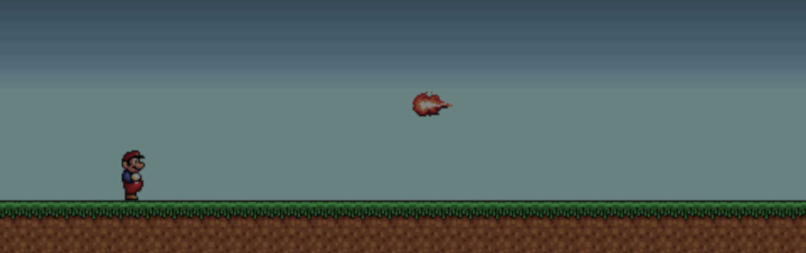

# Jumpman

This was my first ever JavaFX application. Its intended purpose was to:

- help me learn JavaFX, especially properties and bindings.
- have fun programming a game with sprites, physics and side-scrolling.
- apply the State design pattern in a comprehensive example.

The game contains a massive 2-line 'physics engine' to update all the game objects. This update triggers bindings that adjust the positions of all the nodes on screen. Keyboard input is fed into a state machine that models the movements of the playable character, like walking, running, braking or jumping.

This was a really fun project to work on and is ever so popular with students. If you enjoy casual game programming or want to learn more about JavaFX or the State pattern, have a look at the source code!

> **Note**: This repository contains a NetBeans project. It was originally developed using JDK 7 and JavaFX 2 in late 2012 and has been updated to JDK 10.
